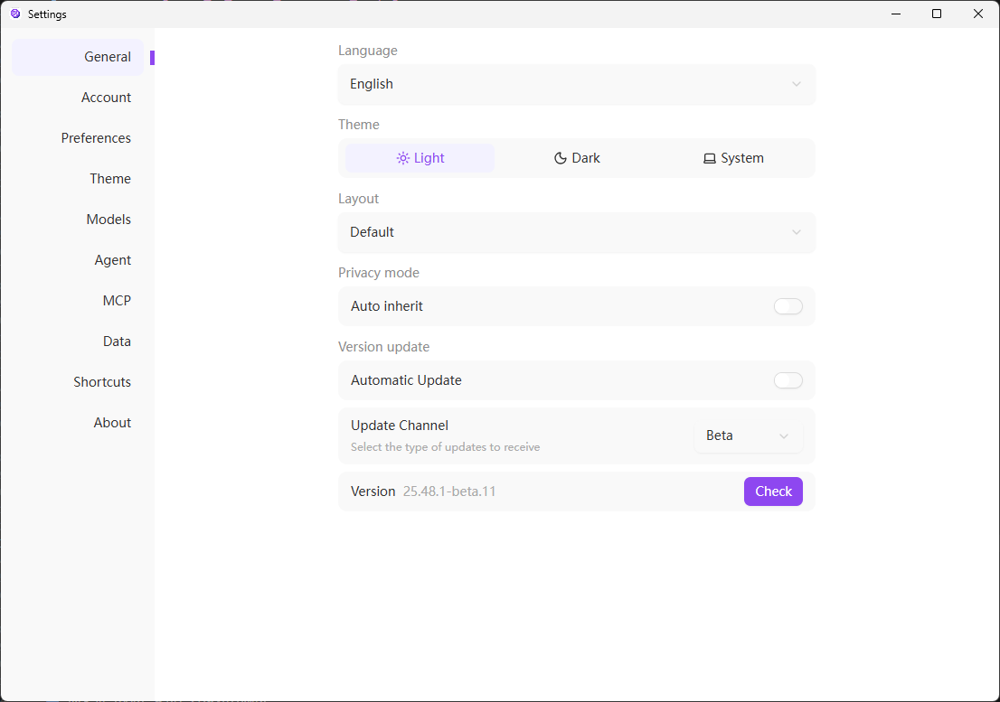
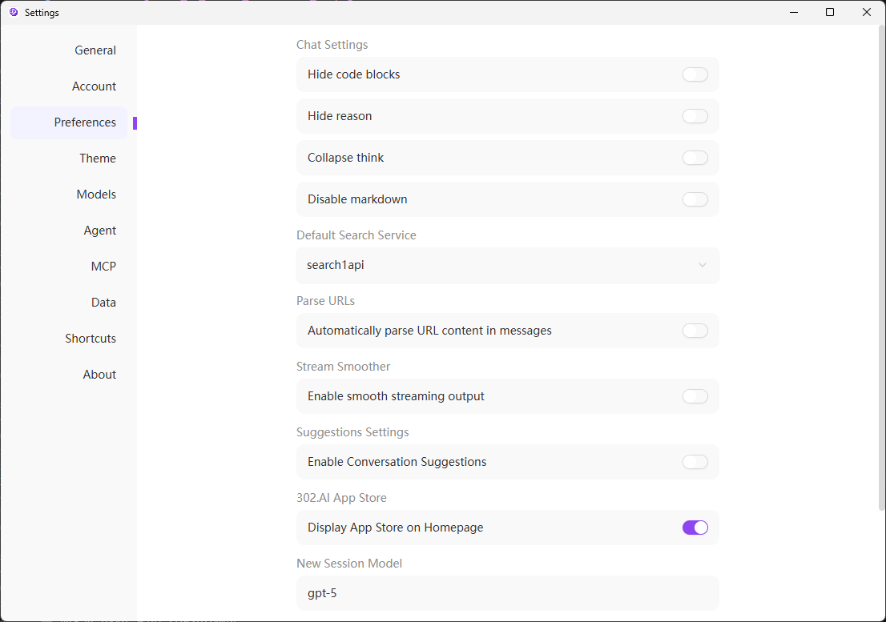

<h1 align="center">

<span>
    302 AI Studio
</span>
</h1>

<p align="center">
<em>302 AI Studio は、Windows、Mac、Linux 向けの複数の LLM サービスプロバイダーをサポートするデスクトップクライアントです。</em>
</p>

<p align="center"><a href="https://302.ai/" target="blank"></a></p >

<p align="center"><a href="README_zh.md">中文</a> | <a href="README.md">English</a> | <a href="README_ja.md">日本語</a></p>

 

## 🖼️ インターフェースのスクリーンショット

ホームチャットインターフェース。メッセージ入力欄、ツールバー、モデル選択、およびよく使う AI ツールへのショートカットを提供


マルチタブチャット画面。左側に会話リスト、右側にチャットウィンドウを表示


クライアント内でワンクリックで AI アプリを素早く起動。ウェブサイトに移動する必要なし


独立ウィンドウ形式の設定ページ。一般、アカウント、設定、MCP などのよく使う構成を含む



エージェントサンドボックス管理ページ。リモート／ローカルプラットフォームの切り替え、エージェントサンドボックスリストの閲覧と管理をサポート


## 🌟 主な特徴

### マルチモデル・マルチプロバイダーサポート
- 🤖 OpenAI、Anthropic、Google などの主要 AI プロバイダーをサポート
- 🔄 柔軟なモデル切り替えと設定
- 🎛️ 高度な対話パラメータ制御（温度、top-p、トークン制限など）
- 📊 MCP（Model Context Protocol）サーバー統合

### ドキュメントとデータ処理
- 🖼️ 画像をアップロードして AI による内容分析や説明生成
- 📄 複数のファイル形式をサポート
- 💻 コード構文ハイライト
- 📊 Mermaid 図の可視化
- 📝 完全な Markdown レンダリングサポート

### 優れたユーザー体験
- 🖥️ Windows、Mac、Linux のマルチプラットフォームサポート
- 🌙 リアルタイムプレビュー付きのカスタマイズ可能なライト/ダークテーマシステム
- 👤 アカウントログインに対応し、残高や利用状況の確認が可能
- 📝 完全な Markdown レンダリング
- 📱 レスポンシブデザイン、あらゆる画面サイズに完璧に対応
- 🎨 Shadcn-Svelte ベースのモダンなコンポーネントライブラリ

### 効率的なワークフロー
- 🗂️ 複数の対話スレッドを同時に管理、整理されて明確
- ⚡ リアルタイムストリーミングレスポンスサポート
- ⌨️ 完全なキーボードショートカットシステム
- 🔄 ホットモジュールリプレースメント（HMR）サポート、スムーズな開発体験

### エージェントモード
- 🤖 リモートサンドボックス環境を通じて Claude Code を呼び出し、作業タスクをインテリジェントに計画
- 🎯 エージェントタスクの実行とリアルタイムモニタリングで、タスクの進捗や状態を追跡
- 🔄 複雑なタスクの分割や協力を支援するインテリジェントなワークフロー管理
- 📊 エージェントセッションの統計と分析、実行履歴やパフォーマンスデータの確認
- 🚀 ワンクリックでフルスタックアプリをデプロイ、エージェントが自動でコード作成・テスト・デプロイを実施
- 📦 複数の技術スタックに対応し、WebアプリやAPIサービスなどを素早く構築

### 多言語サポート
- **中文**
- **English**
- **日本語**（近日対応予定）

## 🛠️ 技術アーキテクチャ

### 🏗️ コア技術スタック

| レイヤー | 技術 | 説明 |
|----------|------|------|
| **UI レイヤー** | SvelteKit 5 + TypeScript | モダンなコンポーネント開発、型安全性、リアクティブな状態管理 |
| **スタイルレイヤー** | TailwindCSS 4.x + カスタムテーマシステム | アトミックCSS + スムーズなアニメーション |
| **デスクトップ** | Electron 38 | クロスプラットフォームデスクトップアプリケーションフレームワーク |
| **状態管理** | Svelte 5 Runes | リアクティブな状態管理（`$state`, `$derived`） |
| **UI コンポーネントライブラリ** | Shadcn-Svelte (bits-ui) | モダンでアクセシブルなコンポーネントライブラリ |
| **国際化** | Inlang Paraglide-js | 多言語サポート |
| **AI 統合** | AI SDK | 統一された AI プロバイダーインターフェース |
| **ビルドツール** | Vite + Electron Forge | 高速ビルド + ホットリロード |
| **型システム** | TypeScript | 厳密な型チェック |
| **コード品質** | ESLint + Prettier + Vitest + Playwright | コード規約 + ユニットテスト + E2E テスト |

## 🚀 クイックスタート

### 📋 システム要件

- **オペレーティングシステム**: Windows 10+ / macOS 10.14+ / Linux (Ubuntu 18.04+)
- **Node.js**: 18.x 以降
- **パッケージマネージャー**: pnpm 10.18.3+（必須）
- **メモリ**: 4GB RAM（8GB+ 推奨）
- **ストレージ**: 500MB の空き容量
- **ネットワーク**: 安定したインターネット接続（AI プロバイダーAPI にアクセスするため）

### ⚡ インストールと起動

```bash
# 1️⃣ プロジェクトをクローン
git clone https://github.com/302ai/302-AI-Studio-sv.git
cd 302-AI-Studio-sv

# 2️⃣ 依存関係をインストール
pnpm install

# 3️⃣ 開発サーバーを起動 🎉
pnpm dev
```

> [!WARNING]
> このプロジェクトは `pnpm` をパッケージマネージャーとして使用する必要があります。プロジェクトには SvelteKit の必要なパッチが含まれており、他のパッケージマネージャーでは正常に動作しない場合があります。

## 📦 ビルドとデプロイ

### 🔧 開発コマンド

```bash
# 開発サーバーを起動（ホットリロード対応）
pnpm dev

# 型チェック
pnpm check

# コードリンティング
pnpm lint

# リンティング問題を自動修正
pnpm lint:fix

# コードをフォーマット
pnpm format

# コードフォーマットをチェック
pnpm format:check

# 完全な品質チェック
pnpm quality

# すべての問題を自動修正
pnpm quality:fix
```

### 🧪 テスト

```bash
# ユニットテストを実行
pnpm test:unit

# E2E テストを実行
pnpm test:e2e

# すべてのテストを実行
pnpm test
```

### 🚀 本番ビルド

```bash
# SvelteKit アプリケーションをビルド
pnpm build

# Electron アプリをパッケージ化（出力は /out ディレクトリ）
pnpm package

# 配布可能なインストーラーを作成
pnpm make

# 設定されたターゲットに公開
pnpm publish
```

### 📱 クロスプラットフォームサポート

| プラットフォーム | アーキテクチャ | ステータス |
|------------------|----------------|------------|
| Windows | x64 / ARM64 | ✅ 完全サポート |
| macOS | x64 / Apple Silicon | ✅ 完全サポート |
| Linux | x64 / ARM64 | ✅ 完全サポート |

## 🛠️ 開発ガイド

### 📁 プロジェクト構造

```
📦 302-AI-Studio-sv
├── 📂 src/                          # レンダラープロセスソースコード
│   ├── 📂 lib/                       # 共有ライブラリ
│   │   ├── 📂 components/            # UI コンポーネント
│   │   │   ├── ui/                   # Shadcn-Svelte ベースコンポーネント（40+）
│   │   │   └── buss/                 # ビジネスコンポーネント
│   │   │       ├── chat/             # チャットインターフェース
│   │   │       ├── model-*/          # モデル選択と設定
│   │   │       ├── provider-*/       # AI プロバイダー管理
│   │   │       ├── theme-*/          # テーマシステム
│   │   │       └── settings/         # アプリケーション設定
│   │   ├── 📂 stores/                # 状態管理（Svelte 5 Runes）
│   │   ├── 📂 types/                 # TypeScript 型定義
│   │   ├── 📂 api/                   # API 統合レイヤー
│   │   ├── 📂 utils/                 # ユーティリティ関数
│   │   ├── 📂 theme/                 # テーマシステム
│   │   ├── 📂 datas/                 # 静的データ
│   │   └── 📂 hooks/                 # Svelte Hooks
│   ├── 📂 routes/                    # ルート
│   │   ├── (with-sidebar)/           # メインアプリケーションレイアウト
│   │   │   └── chat/                 # チャットインターフェースルート
│   │   ├── (settings-page)/          # 設定ページレイアウト
│   │   │   └── settings/             # 設定ルートグループ
│   │   └── shell/                     # Shell ウィンドウルート
│   ├── 📂 shared/                    # プロセス間共有コード
│   │   ├── storage/                  # 永続ストレージ
│   │   └── types/                    # 共有型
│   ├── 📂 messages/                  # 国際化メッセージファイル
│   └── 📄 app.html                   # HTML テンプレート
├── 📂 electron/                      # Electron メインプロセス
│   ├── main/                         # メインプロセスコード
│   │   ├── services/                 # IPC サービス
│   │   ├── generated/                # 自動生成された IPC バインディング
│   │   └── constants/                # Electron 定数
│   └── preload/                      # Preload スクリプト
├── 📂 vite-plugins/                  # カスタム Vite プラグイン
│   └── ipc-service-generator/        # IPC サービスジェネレーター
├── 📂 scripts/                       # ビルドスクリプト
├── 📂 docs/                          # ドキュメント
├── 📂 e2e/                           # Playwright E2E テスト
└── 📄 package.json                   # プロジェクト設定
```

## 🤝 貢献ガイド

あらゆる形式の貢献を歓迎します！バグの報告、新機能の提案、コードの改善など、何でも対応いたします。

### 💡 貢献方法

1. **コード貢献**：コードを改善するための PR を送信
2. **バグ修正**：発見した問題の修正を送信
3. **機能提案**：良いアイデアがあれば喜んでお聞かせください
4. **ドキュメント作成**：ドキュメントと使用ガイドの改善を支援
5. **宣伝**：302 AI Studio を広める

### 📋 貢献ステップ

```bash
# 1. プロジェクトをフォーク
# 2. 機能ブランチを作成
git checkout -b feature/amazing-feature

# 3. 変更をコミット（Conventional Commits に従う）
git commit -m 'feat: add amazing feature'

# 4. ブランチにプッシュ
git push origin feature/amazing-feature

# 5. Pull Request を作成
```


## 💬 お問い合わせ

<div align="center">

[](https://302.ai)
[](https://github.com/302ai/302-AI-Studio-sv)
[](mailto:support@302.ai)

**問題が発生しましたか？** [GitHub Issues](https://github.com/302ai/302-AI-Studio-sv/issues) でフィードバックをお願いします

**機能提案がありますか？** [GitHub Discussions](https://github.com/302ai/302-AI-Studio-sv/discussions) でお待ちしています

</div>

## 📄 ライセンス

このプロジェクトは [AGPL-3.0](LICENSE) のもとでオープンソースであり、自由に使用、変更、配布できます。

## ✨ 302.AI について

[302.AI](https://302.ai) は、実践における AI 適用の最後の 1 マイルの問題を解決する従量課金型の AI アプリケーションプラットフォームです。

1. 🧠 言語モデル、画像モデル、音声モデル、動画モデルなど、最新で最も包括的な AI 機能とブランドを網羅
2. 🚀 基盤モデルに基づく深いアプリケーション開発、単純なチャットボットではなく本物の AI 製品を開発
3. 💰 月額料金ゼロ、すべての機能が従量課金、完全にオープン、真の低障壁と高い上限
4. 🛠️ 強力な管理バックエンド、チームと中小企業をターゲットに、1 人が管理、複数人が使用
5. 🔗 すべての AI 機能が API アクセスを提供、すべてのツールがオープンソースでカスタマイズ可能（進行中）
6. 💡 強力な開発チーム、週 2〜3 の新アプリをリリース、製品は毎日更新。参加に興味のある開発者はお気軽にお問い合わせください

